# Index
- [Quickstart for GitHub Actions](#quickstart-for-github-actions)
  - [Introduction](#introduction)
  - [Creating your first workflow](#creating-your-first-workflow)
  - [Viewing your workflow result](#viewing-your-workflow-results)
- [Repository Templates Meets GitHub Actions](#repository-templates-meets-github-actions)
  - [GitHub Actions can be much more than Ci-Cd](#github-actions-can-be-much-more-than-ci-cd)
  - [Project scaffolding meets GitHub Actions](#project-scaffolding-meets-github-actions)
  - [Drawback](#drawback)
- [Generate new repositories with repository templates](#generate-new-repositories-with-repository-templates)
- [Dynamically Create Projects With Github Templates and Actions](#dynamically-create-projects-with-github-templates-and-actions)
  - [The Code](#the-code)
  - [Setting up the workflowPermalink](#setting-up-the-workflowpermalink)
  - [Run the job only if the branch is masterPermalink](#run-the-job-only-if-the-branch-is-masterpermalink)
  - [Setup .NET Core projects](#setup-net-core-projects)
  - [Add, Commit and Push Changes as part of the workflow](#add-commit-and-push-changes-as-part-of-the-workflow)
  - [Bringing it all together](#bringing-it-all-together)
- [Using the template repository](#using-the-template-repository)
- [Bibliography](#bibliography)

# Quickstart for GitHub Actions

## Introduction

You only need a GitHub repository to create and run a GitHub Actions workflow.
In this guide, you'll add a workflow that demonstrates some of the essential
features of GitHub Actions.

The following example shows you how GitHub Actions jobs can be automatically
triggered, where they run, and how they can interact with the code in your
repository.

## Creating your first workflow

    1. From your repository on GitHub, create a new file in the .github/workflows directory named github-actions-demo.yml.
    2.Copy the following YAML contents into the github-actions-demo.yml file:

```yaml
name: GitHub Actions Demo
on: [push]
jobs:
  Explore-GitHub-Actions:
    runs-on: ubuntu-latest
    steps:
        - run: echo "🎉 The job was automatically triggered by a ${{ github.event_name }} event."
        - run: echo "🐧 This job is now running on a ${{ runner.os }} server hosted by GitHub!"
        - run: echo "🔎 The name of your branch is ${{ github.ref }} and your repository is ${{ github.repository }}."
        - name: Check out repository code
          uses: actions/checkout@v2
        - run: echo "💡 The ${{ github.repository }} repository has been cloned to the runner."
        - run: echo "🖥️ The workflow is now ready to test your code on the runner."
        - name: List files in the repository
          run: |
            ls ${{ github.workspace }}
        - run: echo "🍏 This job's status is ${{ job.status }}."
```
    3. Scroll to the bottom of the page and select Create a new branch for this commit and start a pull request. Then, to create a pull request, click Propose new file.

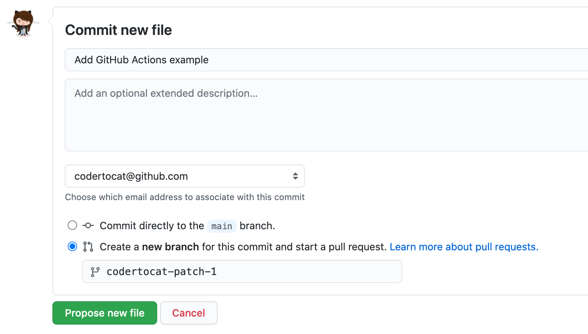

Committing the workflow file to a branch in your repository triggers the push
event and runs your workflow.

## Viewing your workflow results

    1. En GitHub, visita la página principal del repositorio.
    2. Debajo del nombre de tu repositorio, da clic en Acciones. Pestaña de acciones en la navegación del repositorio principal


    3. In the left sidebar, click the workflow you want to see.

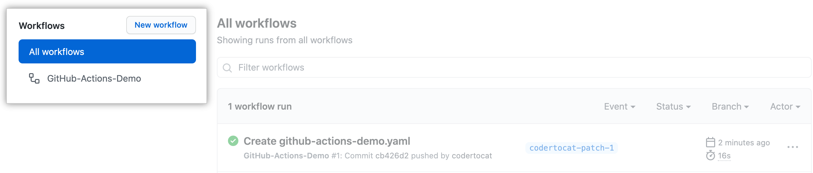

    4. From the list of workflow runs, click the name of the run you want to see.

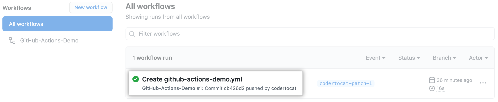

    5. Under Jobs , click the Explore-GitHub-Actions job.

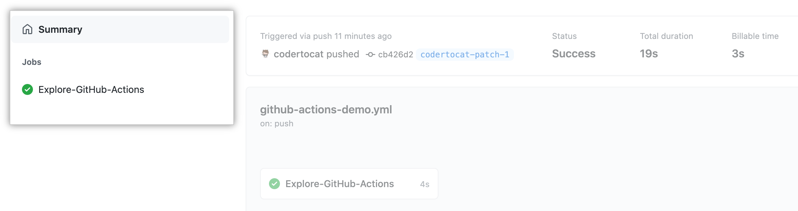

    6. The log shows you how each of the steps was processed. Expand any of the steps to view its details.

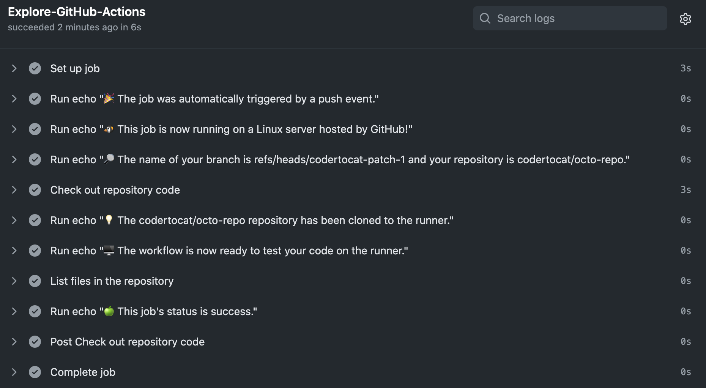

    For example, you can see the list of files in your repository:

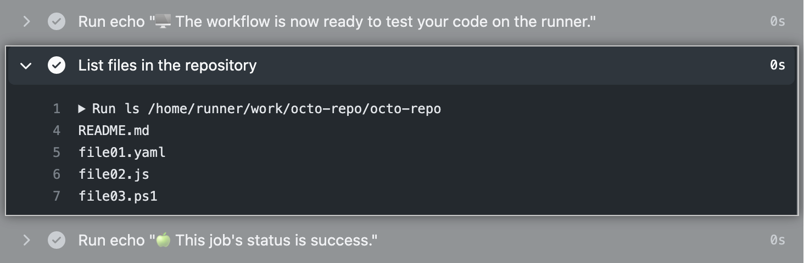

---

# Repository Templates Meets GitHub Actions

    GitHub introduced Repository Templates giving users an easy way to share
    boilerplate for their projects. This feature is fantastic, but lacking
    adoption to my knowledge and opinion for one reason.

    Generating a new repository from a repository template is literally only a
    copy of the original source repository. This however is often just half the
    story when creating a new repository. For instance a way to specify template
    variables is missing to customize the resulting repository.

    Wouldn't it be helpful if you could specify the project name, version, or
    author which is then templated into the resulting new repository?

## GitHub Actions can be much more than Ci-Cd

    The primary usage of GitHub Actions is CI/CD, but it offers much more than
    that. I think of GitHub Actions as a compute service running on top of GitHub’s
    infrastructure. You can run a workflow on any GitHub event like push, issue
    creation, or a new release. This is incredibly powerful and unlocks a wide
    range of use cases. In combination with repository templates you can make
    template variables work.

## Project scaffolding meets GitHub Actions

    The main problem with any scaffolding tool is that you have to install it on
    your computer. Such tools often depend on a specific language and version
    which you may not have installed at all.

    Wouldn't it be better to create repositories with templated values without
    ever leaving the browser? Not having to navigate to your terminal,
    installing a runtime and dependencies?

    In this example, I use cookiecutter, but in theory, this works with any
    scaffolding tool that you can instrument without prompting questions to
    the user. With the --no-input argument, cookiecutter does not prompt for
    user input and only uses values from the cookiecutter.json file.

    The cookiecutter-template repository contains a workflow file for GitHub
    Actions that runs whenever the cookiecutter.json file is modified. After
    creating a new repository from the template repository, the user is asked
    to complete the setup by editing the cookiecutter.json using GitHub’s file
    edit functionality. Once the file gets committed, the setup-repository
    workflow gets invoked. This workflow does a few things, but in essence,
    it runs cookiecutter and re-initializes the repository with the generated
    files. It’s worth clarifying, that the re-initialization step removes the
    .github/workflows/setup-repository.yml along with the cookiecutter template
    files and only the actual generated project structure is left in the
    repository. The illustration below explains the steps involved.


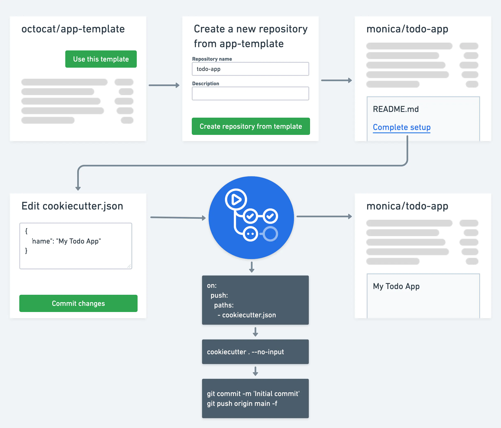

</p>

## Drawback

    There is one limitation, if the template contains one or more GitHub Actions
    workflow files, the re-initializion will fail with Git Error: Refusing to
    allow a GitHub App to create or update workflow without workflows permission.
    This is by design to prevent third-parties from adding malicious workflow
    files. However, with one additional step you can still make it work.

    Generate a new personal access token with the workflow scope and configure
    the workflow to use this token instead of the one provided by default.
    Depending on your use-case for template repositories you have the following
    options to make this work.

    a) Rather than storing your workflow files as templates, store them straight
    in .github/workflows/. All you have to do then is to preserve those files
    while re-initializing the repository. Be aware, that this means you can
    not template any values in these files anymore.

    b) Encourage the user to create a GitHub Action secret with a personal access
    token with the desired workflow permission before editing the cookiecuter.json
    file. After re-initializing the repository, the workflow will remove this
    secret automatically by convention if the token is named REPO_SETUP_TOKEN.

    c) For repository templates shared within an organization, it’s best to create
    an organization action secret that contains such a personal access token.

---

## Generate new repositories with repository templates

    Sharing boilerplate code across codebases is a constant pattern in software
    development. Bootstrapping a new project with our favorite tools and
    directory structures helps programmers go from idea to “Hello world!”
    more efficiently and with less manual configuration.

    Today, we’re excited to introduce repository templates to make boilerplate
    code management and distribution a first-class citizen on GitHub. To get
    started, all you need to do is mark a repository as a template, and you’ll
    immediately be able to use it to generate new repositories with all of the
    template repository’s files and folders.

    Whenever you view a template repository, you’ll see a brand new “Use this
    template” button that enables you to get started with that codebase in
    seconds. Any templates you own, have access to through one of your
    organization memberships, or have used previously will be available
    from the new repository page, too.

    Every template repository gets a new URL endpoint called /generate that
    allows you to distribute your template more efficiently. Writing a
    tutorial? Building an app boilerplate for your enterprise? Distributing
    a project framework? Just link your users directly to the /generate
    endpoint. All they’ll need to do is name their project and clone their new
    repository to get started.

    This is just the beginning for repository templates. We’re excited to bring
    more capabilities to all of our template types—repositories, issues, and
    pull requests—to help you spend less time repeating work so you can get
    back to building new things. In the meantime, share your templates with
    the world and let us know how to make templates work better for you in
    the future!

---

## Dynamically Create Projects With Github Templates and Actions

## The Code
    I have a workflow called init.yml. This is the workflow that runs when a new
    repository is created and will create the project.

    The great thing about Github Actions is that we can also set conditionals.
    What I’ve done here is set it so that the entire job will only run of the
    branch is on master and the trigger is create. As an aside, this currently
    runs when other branches are created, but the job labelled build will only
    run if its the master branch, so essentially nothing happens unless the
    branch being created is master. There might be some other edge cases that
    might trigger it and run all the actions but I’ve not come across them yet.

## Setting up the workflowPermalink

    As I mentioned, I want this to run on a create event.

```
name: Init Project

# Controls when the action will run. Triggers the workflow on push or pull request
# events but only for the master branch
on: create
```

## Run the job only if the branch is masterPermalink

    The if: condition is set on the entire job labelled build. I’m using the
    environment variable github.ref and checking that it is equal to the ref for master.

    Anything that doesn’t meet that criteria will mean that the whole job is ignored.

```
# A workflow run is made up of one or more jobs that can run sequentially or in parallel
jobs:
  # This workflow contains a single job called "build"
  build:
    if: github.ref == 'refs/heads/master'

    # The type of runner that the job will run on
    runs-on: ubuntu-latest
```

## Setup .NET Core projects

    At this point, the workflow is running the standard steps to configure it for .NET Core
```
# Steps represent a sequence of tasks that will be executed as part of the job
    steps:
    # Checks-out your repository under $GITHUB_WORKSPACE, so your job can access it
    - uses: actions/checkout@v2

    - name: Setup .NET Core SDK
      uses: actions/setup-dotnet@v1.5.0
      with:
        # SDK version to use. Examples: 2.2.104, 3.1, 3.1.x
        dotnet-version: 3.1.x
```

    Here’s where we start doing things that for me at least, wouldn’t be expected
    as part of a workflow - creating the projects itself. There’s nothing fancy
    here really but one of the reasons I wanted to do this as part of the template
    repo as I actually prefer this way to have it setup all the right namespaces.
    It’s plenty enough for creating a basic Web API project and then any special
    needs for a specific project I can go ahead and add to that project.

    What I am doing here though is naming the projects after the repository name,
    excluding my Github user name by using github.event.repository.name. This
    provides the repo name as part of the event metadata for the workflow.

```
    - name: Generate project
      run: dotnet new webapi --name ${{ github.event.repository.name }}

    - name: Generate test project
      run: dotnet new xunit --name ${{ github.event.repository.name }}.UnitTests

```

# Add, Commit and Push Changes as part of the workflow

    Of course what we’ve done here is create a bunch of files that we actually want
    to commit back to our repo. To do this, I use the actions-x/commit action. You
    can add custom messages and all sorts, but I’m quite happy with the defaults.
    ```
    - name: Git Commit/Push Changes
      uses: actions-x/commit@v1
    ```
## Bringing it all together
```
name: Init Project

# Controls when the action will run. Triggers the workflow on push or pull request
# events but only for the master branch
on: create

# A workflow run is made up of one or more jobs that can run sequentially or in parallel
jobs:
  # This workflow contains a single job called "build"
  build:
    if: github.ref == 'refs/heads/master'

    # The type of runner that the job will run on
    runs-on: ubuntu-latest

    # Steps represent a sequence of tasks that will be executed as part of the job
    steps:
    # Checks-out your repository under $GITHUB_WORKSPACE, so your job can access it
    - uses: actions/checkout@v2

    - name: Setup .NET Core SDK
      uses: actions/setup-dotnet@v1.5.0
      with:
        # SDK version to use. Examples: 2.2.104, 3.1, 3.1.x
        dotnet-version: 3.1.x

    - name: Generate project
      run: dotnet new webapi --name ${{ github.event.repository.name }}

    - name: Generate test project
      run: dotnet new xunit --name ${{ github.event.repository.name }}.UnitTests

    - name: Git Commit/Push Changes
      uses: actions-x/commit@v1

```

## Using the template repository

    First of all, we need to tell Github the repository is a template repo. This is
    done by going to Settings and checking the Template repository box.

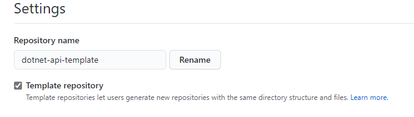

    Now that means we can use this to create new repositories from.

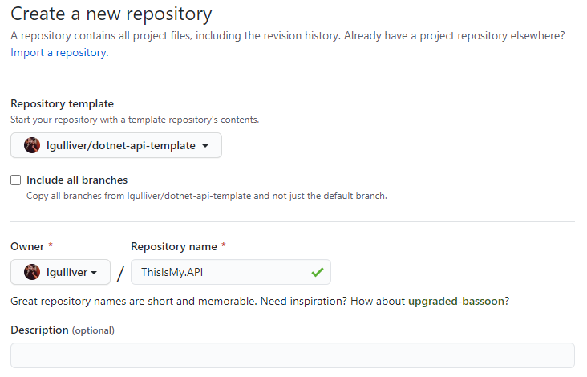

    Once you’ve named your new repo and hit the Create Repository button, a new
    repo will be created containing just the files from the template repository
    at this point.

    ```
    |   .gitignore
    |      LICENSE
    \---    .github
        |   dependabot.yml
        \---workflows
                ci.yml
                init.yml
    ```
    It’ll take a minute or two but the Init Project workflow will run. You can
    check on it under the Actions tab.

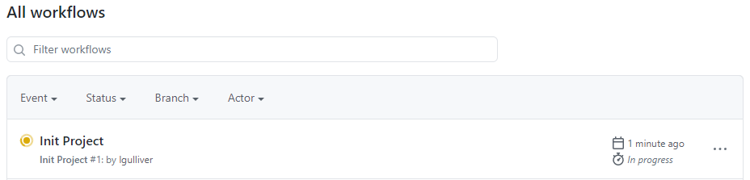

    Once it’s completed, a new commit will be generated in the repository with the
    new .NET Core project files created too.

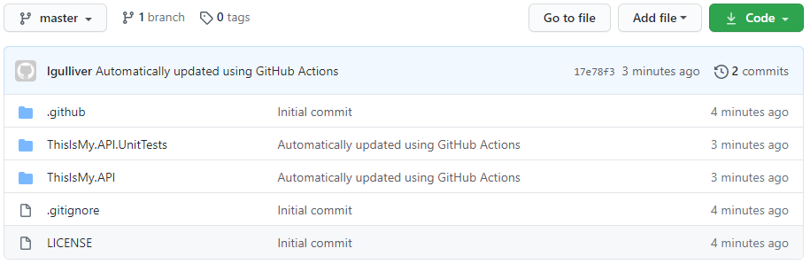

    The new file structure should look a little something like this:
  ```
  |   .gitignore
  |   LICENSE
  |
  +---.github
  |   |   dependabot.yml
  |   |
  |   \---workflows
  |           ci.yml
  |           init.yml
  |
  +---ThisIsMy.API
  |   |   appsettings.Development.json
  |   |   appsettings.json
  |   |   Program.cs
  |   |   Startup.cs
  |   |   ThisIsMy.API.csproj
  |   |   WeatherForecast.cs
  |   |
  |   +---Controllers
  |   |       WeatherForecastController.cs
  |   |
  |   \---Properties
  |           launchSettings.json
  |
  \---ThisIsMy.API.UnitTests
          ThisIsMy.API.UnitTests.csproj
          UnitTest1.cs
  ```
## Bibliography


https://docs.github.com/es/actions/quickstart#introduction

https://stefanbuck.com/blog/repository-templates-meets-github-actions

https://github.blog/2019-06-06-generate-new-repositories-with-repository-templates/

https://lgulliver.github.io/dynamically-generate-projects-with-github-templates-and-actions/